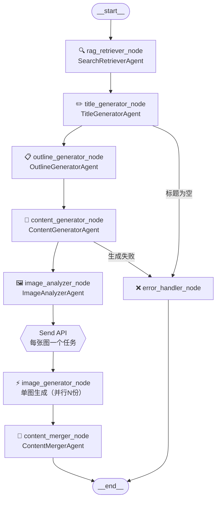

# Agent 编排层升级为 LangGraph 架构建议

> 基于现有 `ArticleAgentOrchestrator` 设计，结合 LangGraph 核心能力，提供渐进式迁移方案。

---

## 1. 现状分析与升级动机

### 1.1 现有架构的局限

| 问题 | 具体表现 |
|------|----------|
| **线性耦合** | Phase1/2/3 硬编码顺序，无法动态跳转或条件分支 |
| **状态管理分散** | `ArticleState` 在各 Agent 间手动传递，无版本快照 |
| **错误恢复困难** | 某个 Agent 失败只能整体重跑，无法从断点续跑 |
| **并行粒度粗** | 仅 `ParallelImageGenerator` 并行，其余串行 |
| **可观测性弱** | 依赖手动打点，无原生执行轨迹 |

### 1.2 LangGraph 带来的核心收益

- **StateGraph**：状态机式编排，每步状态自动快照，天然支持断点续跑
- **条件边（Conditional Edge）**：根据运行结果动态决定下一个节点
- **Send API**：原生 Map-Reduce 并行，替代手写 `asyncio.gather`
- **Checkpointer**：状态持久化，崩溃后可从任意节点恢复
- **LangSmith 集成**：零成本获得完整执行 Trace

---

## 2. 核心概念映射

将现有概念映射到 LangGraph 原语，**保持命名习惯不变**：

| 现有概念 | LangGraph 对应 | 说明 |
|----------|---------------|------|
| `ArticleState` dataclass | `TypedDict` State | 改为 TypedDict，字段完全复用 |
| `execute_phase1/2/3` | Graph Node | 每个方法拆为独立 Node 函数 |
| 手动 `asyncio.create_task` | Graph 异步执行 | 由 Graph 引擎托管 |
| `ParallelImageGenerator` | `Send` API（Map-Reduce） | 每张图一个子任务并行 |
| Phase 间的顺序调用 | Graph Edge（有向边） | 显式声明依赖关系 |
| 异常时 `status=FAILED` | 条件边 → `error_node` | 统一错误路由 |
| `SseEmitterManager.emit` | Node 内部调用（不变） | SSE 层无需改动 |
| `AgentLogService` | Node 前后 Hook | 复用现有落库逻辑 |

---

## 3. 目标架构设计

### 3.1 Graph 整体拓扑



### 3.2 State 定义（基于现有 ArticleState 扩展）

```python
from typing import TypedDict, Annotated
from langgraph.graph.message import add_messages

class ArticleState(TypedDict):
    # ── 输入参数（不变）──────────────────────────────
    task_id:        str
    topic:          str
    platform:       str
    style:          str

    # ── RAG 检索结果（Phase 0）──────────────────────
    rag_context:    RAGContext | None

    # ── 各阶段产出（与现有字段对齐）─────────────────
    title_options:  list[str]
    selected_title: str
    outline:        str
    content:        str

    # ── 配图相关────────────────────────────────────
    image_requirements: list[ImageRequirement]   # ImageAnalyzerAgent 输出
    images:             list[ImageResult]        # 并行生成结果（reduce 聚合）

    # ── 最终产出────────────────────────────────────
    full_content:   str

    # ── 运行时元数据────────────────────────────────
    current_phase:  str                          # 当前执行阶段，供 SSE 推送
    error:          str | None                   # 错误信息，非空则路由到 error_node
    trace_id:       str                          # 与 AgentLogService 对齐
```

### 3.3 节点实现模式

每个 Agent 保持现有类结构，只新增一个 **Node 适配函数**（薄包装层）：

```python
# ── 原有 Agent 类不动 ──────────────────────────────────────
class TitleGeneratorAgent(RAGLoggerMixin):
    async def run(self, service, state: ArticleState) -> ArticleState:
        # 现有业务逻辑完全不变
        ...

# ── 新增 Node 适配函数（每个 Agent 对应一个）──────────────
async def title_generator_node(state: ArticleState) -> dict:
    """
    LangGraph Node 函数：
    - 输入：完整 State（由 Graph 引擎注入）
    - 输出：dict，只包含本节点更新的字段（LangGraph 自动合并）
    - SSE 推送、日志落库在此处触发
    """
    start = datetime.now()
    agent = TitleGeneratorAgent()

    try:
        result = await agent.run(service=..., state=state)
        agent.log_to_db("SUCCESS", start, datetime.now(), ...)
        sse_emitter_manager.emit(state["task_id"], AGENT1_COMPLETE)

        return {
            "title_options": result["title_options"],
            "current_phase": "phase1_complete",
        }
    except Exception as e:
        return {"error": str(e), "current_phase": "failed"}
```

### 3.4 并行配图：Send API（替代手写 gather）

```python
from langgraph.types import Send

def image_dispatch_node(state: ArticleState) -> list[Send]:
    """
    Map 阶段：将每个配图需求拆为独立任务并行下发。
    返回 Send 列表，LangGraph 自动并行执行。
    """
    return [
        Send(
            node="image_generator_node",
            arg={"requirement": req, "task_id": state["task_id"]}
        )
        for req in state["image_requirements"]
    ]

async def image_generator_node(state: dict) -> dict:
    """单图生成节点，多实例并行运行"""
    result = await generate_single_image(state["requirement"])
    return {"images": [result]}   # Reducer 自动追加到列表

# State 中 images 字段使用 Reducer 合并并行结果：
# images: Annotated[list[ImageResult], operator.add]
```

### 3.5 条件边（错误路由）

```python
def route_after_title(state: ArticleState) -> str:
    """标题生成后的路由决策"""
    if state.get("error"):
        return "error_handler_node"
    if not state.get("title_options"):
        return "error_handler_node"
    return "outline_generator_node"

# 注册条件边
graph.add_conditional_edges(
    "title_generator_node",
    route_after_title,
    {
        "outline_generator_node": "outline_generator_node",
        "error_handler_node":     "error_handler_node",
    }
)
```

---

## 4. 迁移策略：渐进式三阶段

### 第一阶段（低风险）：图结构替换编排逻辑，Agent 不动

**改动范围**：仅 `orchestrator.py`，所有 Agent 类零改动。

```
新增文件：
  app/agent/graph/article_graph.py    # Graph 定义
  app/agent/graph/nodes.py            # Node 适配函数（薄包装）
  app/agent/graph/state.py            # ArticleState TypedDict 定义
  app/agent/graph/conditions.py       # 条件边函数

修改文件：
  app/agent/orchestrator.py           # 用 graph.astream() 替代手动 phase 调用
```

`ArticleAsyncService` 调用方式变化极小：

```python
# 改前
await orchestrator.execute_phase1(service, state, stream_handler)
await orchestrator.execute_phase2(service, state, stream_handler)

# 改后
async for chunk in graph.astream(initial_state, config):
    # chunk 即每个 Node 输出的 State 增量
    sse_emitter_manager.emit(task_id, chunk["current_phase"])
```

### 第二阶段：接入 Checkpointer（断点续跑）

```python
from langgraph.checkpoint.postgres.aio import AsyncPostgresSaver

checkpointer = AsyncPostgresSaver.from_conn_string(settings.database_url)
graph = article_graph.compile(checkpointer=checkpointer)

# 从指定快照恢复（task_id 即 thread_id）
config = {"configurable": {"thread_id": task_id}}
await graph.astream(None, config)   # None = 从上次快照继续
```

### 第三阶段：Human-in-the-Loop（标题人工确认）

```python
from langgraph.types import interrupt

async def title_generator_node(state: ArticleState) -> dict:
    title_options = await agent.generate_titles(state)

    # 暂停执行，等待用户选择
    selected = interrupt({"title_options": title_options})

    return {"selected_title": selected, "title_options": title_options}
```

前端调用：
```python
# 用户选好标题后，携带选择结果恢复执行
await graph.aupdate_state(config, {"selected_title": user_choice})
await graph.astream(None, config)
```

---

## 5. 与现有基础设施的集成

### 5.1 SSE 层：零改动

`SseEmitterManager` 完全不动，在 Node 函数内部按原有方式调用：

```python
# Node 函数内，与现有 emit 调用方式完全一致
sse_emitter_manager.emit(state["task_id"], AGENT2_COMPLETE)
```

### 5.2 AgentLogService：复用 RAGLoggerMixin

Node 函数继承 `RAGLoggerMixin`，`log_to_db` 自动从 `contextvars` 读取 `trace_id`：

```python
async def outline_generator_node(state: ArticleState) -> dict:
    set_rag_trace(trace_id=state["trace_id"])   # 入口设置一次
    # 后续所有 self.log_to_db() 自动携带 trace_id
    ...
```

### 5.3 ArticleAsyncService：改动最小化

```python
class ArticleAsyncService:
    async def start_generation(self, task_id: str, ...):
        # 改前：三个 create_task 分别启动三个 phase
        # 改后：一个 create_task 启动 graph.astream

        asyncio.create_task(
            self._run_graph(task_id, initial_state)
        )

    async def _run_graph(self, task_id: str, state: ArticleState):
        config = {"configurable": {"thread_id": task_id}}
        try:
            async for chunk in graph.astream(state, config):
                # DB 状态更新逻辑不变
                await self._update_db_status(task_id, chunk)
        except Exception as e:
            await self._mark_failed(task_id, str(e))
```

---

## 6. 目录结构变更

```
app/agent/
├── graph/                          # 新增：LangGraph 相关
│   ├── __init__.py
│   ├── article_graph.py            # Graph 定义与编译
│   ├── state.py                    # ArticleState TypedDict
│   ├── nodes.py                    # 所有 Node 适配函数
│   └── conditions.py               # 条件边路由函数
├── agents/                         # 不动：现有 Agent 类
│   ├── search_retriever_agent.py
│   ├── title_generator_agent.py
│   ├── outline_generator_agent.py
│   ├── content_generator_agent.py
│   ├── image_analyzer_agent.py
│   └── content_merger_agent.py
└── orchestrator.py                 # 精简：只保留 graph.astream 调用
```

---

## 7. 风险与注意事项

| 风险点 | 说明 | 缓解措施 |
|--------|------|----------|
| **State 类型变更** | `dataclass` → `TypedDict` 需全量替换 | 第一阶段用 `TypedDict` + `from __future__ import annotations` 平滑过渡 |
| **流式输出兼容** | `astream` 输出格式与现有 SSE 消息结构不同 | Node 函数内部仍用 `sse_emitter_manager.emit`，不依赖 Graph 流式输出格式 |
| **Checkpointer 依赖** | 第二阶段需要新增 DB 表（LangGraph 自动创建） | 提前在测试环境验证 schema |
| **并行图副作用** | Send API 并行时 `AgentLogService` 多任务并发写库 | `save_log_async` 已是异步独立任务，天然安全 |

---

## 8. 推荐迁移顺序

```
Week 1：state.py + conditions.py（纯数据结构，无风险）
Week 2：nodes.py（Agent 适配层，不改业务逻辑）
Week 3：article_graph.py（串联 Graph，集成测试）
Week 4：替换 orchestrator.py，灰度上线第一阶段
后续：按需接入 Checkpointer 和 Human-in-the-Loop
```