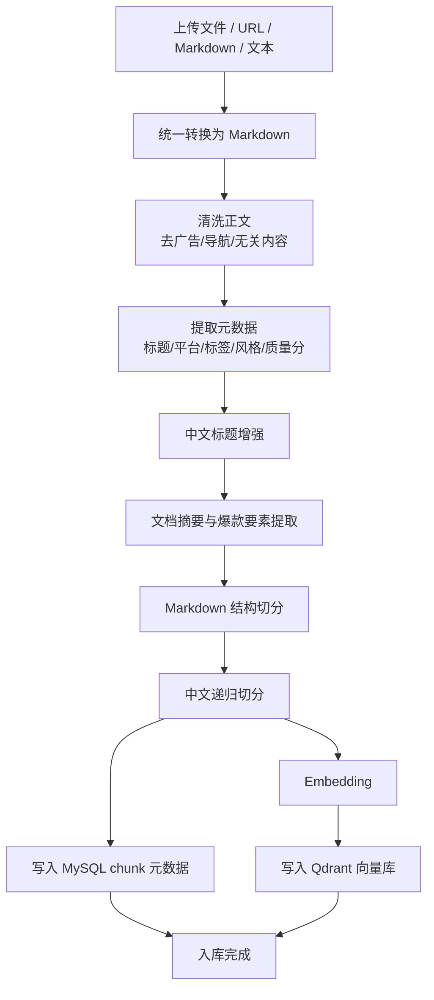
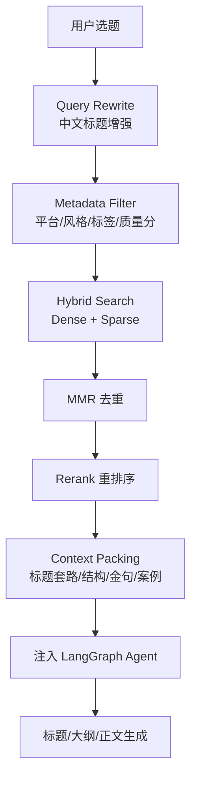

# RAG 技术设计文档规划

## 文档定位

新建文件路径：`RAG_TECH_DESIGN.md`

参考两份来源文档：


- [RAG_design.md](RAG_design.md)：入库/检索流程图 + 技术栈建议摘要

- 桌面 RAG——design.md：6条策略深度分析（切分/向量库/摘要/混合检索）

## 文档章节结构

### 1. 概述与目标
RAG 在本项目中的定位：爆款文章知识库 → 辅助多智能体创作

第一期目标边界

### 2. 技术栈
LangChain:
- langchain
- langchain-community
- langchain-qdrant
- langchain-text-splitters

向量库：
- Qdrant（生产主库）
- FAISS（本地缓存/降级）


关系型数据库：
- 现有 MySQL（新增 `knowledge_document`、`knowledge_chunk` 表）


Embedding:
- DashScope text-embedding-v3（已有 `dashscope_api_key`）

稀疏检索:
- Qdrant FastEmbedSparse / BM25


Rerank:
- 第二阶段接入 DashScope reranker / bge-reranker

LLM:
- 现有 DashScope qwen-plus（元数据提取、摘要生成复用）

基础设施：
- Docker Compose（新增 Qdrant 服务）

### 3. 整体架构图（Mermaid）

两个维度：

系统层级架构：前端 → FastAPI → RAG Service → Qdrant + MySQL

与现有 Agent 的集成：新增 Agent 0（RAG 检索）插入 orchestrator

### 4. 知识库入库流程

### 推荐最终入库流程




文件标准化 → Markdown 转换


正文清洗


元数据提取（LLM）


中文标题增强


文档摘要 + 爆款要素提取


两级切分（MarkdownHeaderTextSplitter → RecursiveCharacterTextSplitter）


Embedding + Qdrant 入库


MySQL chunk 元数据写入

### 5. 检索流程

## 推荐最终检索流程



Query Rewrite / 中文标题增强
Metadata Filter（platform/style/quality_score）
Hybrid Search（Dense + Sparse）
MMR 去重
Rerank 重排序
Context Packing → 注入 LangGraph Agent

### 6. 数据库设计

Qdrant Collection:

`article_chunks`：dense 向量 + sparse 向量 + payload（与 MySQL chunk 元数据对齐）
MySQL 新增两张表：

knowledge_document 表字段：

`id, title, platform, category, style, source_type, source_url, quality_score, tags, summary, structure_summary, viral_elements, status, created_at...`

knowledge_chunk 表字段：
`id, doc_id, chunk_index, section_title, chunk_type, content, keywords, qdrant_point_id, created_at...`

Document.metadata payload 字段（Qdrant payload，与 RAG——design.md 对齐）：
`knowledge_id, chunk_id, platform, style, category, tags, quality_score, chunk_type 等`

### 7. 目录结构

在 `python-backend/app/` 下新增：

```text
app/
├── rag/
│   ├── __init__.py
│   ├── ingestion/
│   │   ├── __init__.py
│   │   ├── document_loader.py      # 文件/URL → Markdown
│   │   ├── text_cleaner.py         # 正文清洗
│   │   ├── metadata_extractor.py   # LLM 提取元数据、标题增强
│   │   ├── summary_generator.py    # 文档摘要 + 爆款要素
│   │   └── chunker.py              # 两级切分
│   ├── embedding/
│   │   ├── __init__.py
│   │   └── dashscope_embeddings.py # DashScope Embedding 封装
│   ├── vectorstore/
│   │   ├── __init__.py
│   │   ├── qdrant_store.py         # Qdrant 主库封装
│   │   └── faiss_cache.py          # FAISS 本地缓存（可选）
│   ├── retrieval/
│   │   ├── __init__.py
│   │   ├── query_rewriter.py       # Query Rewrite / 标题增强
│   │   ├── hybrid_retriever.py     # Dense + Sparse + MMR
│   │   ├── reranker.py             # 重排序（第二阶段）
│   │   └── context_packer.py       # Context Packing → ArticleState
│   └── pipeline.py                 # 统一入库/检索 Pipeline 入口
├── agent/
│   ├── agents/
│   │   └── rag_retriever.py        # 新增 Agent 0：RAG 检索 Agent
│   └── orchestrator.py             # 在 execute_phase1 前插入 execute_phase0
├── routers/
│   └── knowledge.py                # 新增知识库管理 API
└── services/
    └── knowledge_service.py        # 知识库 CRUD + 入库触发
```

### 8. API 设计

知识库管理接口 `/api/knowledge`：

- `POST /knowledge/upload`：上传文件/URL 触发入库
- `GET /knowledge/list`：分页查询知识库文章
- `DELETE /knowledge/{id}`：删除知识库文章

### 9. 与现有系统集成

- `config.py` 新增 Qdrant 配置项（`qdrant_host`、`qdrant_port`、`qdrant_collection`）
- `ArticleAgentOrchestrator` 新增 `execute_phase0` 方法，在 phase1 前调用 RAG 检索，将 context 写入 `ArticleState`
- `ArticleState` 新增 `rag_context` 字段
- `docker-compose.yml` 新增 qdrant 服务
- `sql/` 新增 `add_knowledge_tables.sql`

### 10. 演进路线

- 第一期：基础入库检索链路（无 Rerank）
- 第二期：Rerank + 语义切分 A/B 测试
- 第三期：效果评估 + 检索策略优化

