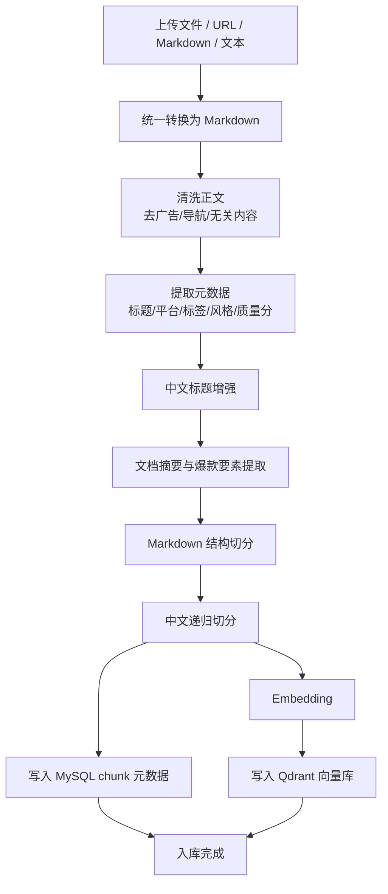
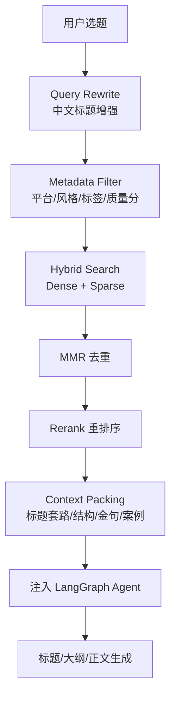

# RAG 策略合理性分析：爆款文章知识库场景

建议文件路径：`docs/RAG_STRATEGY_ANALYSIS.md`

## 结论

你的整体思路是合理的，但需要做几处调整：

- **统一转 Markdown 是对的**，但不要丢失原始结构和元数据。
- **中文标题增强有价值**，但应作为 metadata / query expansion，而不是粗暴改写正文。
- **切分器不要一开始堆很多种**，先用 Markdown 结构切分 + 中文递归切分，语义切分作为增强选项。
- **向量库更推荐 Qdrant**，FAISS 可保留为本地缓存或开发环境方案。
- **摘要生成建议做**，但重点是文档级摘要和结构化卖点摘要，不是每个 chunk 都生成长摘要。
- **检索建议启用混合检索**，但更好的完整链路是：元数据过滤 + 混合检索 + MMR 去重 + 重排序 + 上下文压缩。

参考依据：
- [LangChain Qdrant 集成文档](https://docs.langchain.com/oss/python/integrations/vectorstores/qdrant/)
- [LangChain FAISS 集成文档](https://docs.langchain.com/oss/python/integrations/vectorstores/faiss/)
- [LangChain Text Splitters 文档](https://docs.langchain.com/oss/python/integrations/splitters/index)

## 1. 文件统一转 Markdown 是否合理

合理。

你的知识库目标是“爆款文章检索存储”，文章类内容天然有标题、段落、小标题、列表、引用、图片说明等结构。统一转成 Markdown 有几个好处：

- 结构清晰，便于后续按标题层级切分。
- 对 LLM 友好，后续注入 Prompt 时可读性高。
- 便于保留原文格式，比如标题、列表、引用、重点句。
- 便于后续生成摘要、标签、标题套路、开头模板等结构化信息。

但要注意：**Markdown 只是标准化后的内容格式，不应该是唯一数据源**。

建议存储三层数据：

```text
原始文件 / 原始 URL
        ↓
标准化 Markdown
        ↓
LangChain Document chunks
```

推荐 `Document.metadata` 至少包含：

```json
{
  "knowledge_id": "文章ID",
  "chunk_id": "切片ID",
  "source_type": "url|markdown|text|pdf|docx",
  "source_url": "原始URL",
  "title": "文章标题",
  "platform": "公众号/小红书/知乎/头条",
  "category": "行业分类",
  "style": "科技/情感/教育/幽默",
  "tags": ["AI", "职场", "增长"],
  "section_title": "当前小节标题",
  "chunk_type": "title|opening|body|case|summary|cta",
  "quality_score": 85,
  "created_at": "导入时间"
}
```

不建议只把所有内容塞进 `page_content`，否则后面很难做平台过滤、风格过滤、质量分过滤和溯源展示。

## 2. 中文标题增强是否合理

合理，但要控制用途。

爆款文章创作里，标题是非常重要的检索入口。用户输入通常是短选题，比如：

```text
AI 如何改变职场
```

如果直接拿这个做向量检索，召回可能偏泛。标题增强可以把它扩展成更接近爆款语义的检索表达：

```text
AI改变职场、普通人如何应对AI冲击、AI时代职业竞争力、AI工具提升效率
```

建议标题增强用于两个地方：

1. **入库阶段**
   - 为每篇样本生成：
     - 标准标题
     - 标题关键词
     - 标题套路
     - 适合人群
     - 情绪钩子
   - 这些内容放 metadata 或单独字段。

2. **检索阶段**
   - 对用户选题做 query rewrite / query expansion。
   - 用增强后的多个 query 召回不同角度样本。

不建议把增强标题直接拼回原文正文，否则会污染原始内容。

推荐生成结构：

```json
{
  "original_title": "AI时代，普通人最该掌握的3种能力",
  "enhanced_titles": [
    "AI正在淘汰不会用工具的人",
    "未来5年，职场人必须补上的AI能力",
    "普通人如何抓住AI红利"
  ],
  "title_patterns": [
    "趋势判断 + 人群焦虑",
    "数字清单 + 能力建议",
    "时代变化 + 行动方案"
  ],
  "keywords": ["AI职场", "普通人", "能力提升", "效率工具"]
}
```

## 3. 是否需要多种切分器

不建议一开始引入太多切分器。

你的场景不是通用问答，而是“爆款文章创作参考”。切分目标不是单纯找答案，而是找：

- 标题套路
- 开头方式
- 文章结构
- 案例表达
- 金句
- 转化话术
- 配图灵感

所以切分要优先保留文章结构。

推荐第一期使用两级切分：

```text
Markdown 标题结构切分
        ↓
中文递归字符切分
```

推荐策略：

- 先按 Markdown 标题层级切：
  - `#`
  - `##`
  - `###`
- 再对过长段落用 `RecursiveCharacterTextSplitter`。
- 中文分隔符建议包含：
  - `\n\n`
  - `\n`
  - `。`
  - `！`
  - `？`
  - `；`
  - `，`

建议 chunk 大小：

```text
chunk_size: 600-900 中文字符
chunk_overlap: 80-150 中文字符
```

是否引入阿里的语义切分？

可以，但建议作为第二阶段优化，不要第一期就作为主链路。

原因：

- 语义切分成本更高。
- 不同文章风格下稳定性需要评估。
- 爆款文章的结构边界通常比语义边界更重要。
- 过度语义切分可能破坏“标题-开头-论点-案例-总结”的完整创作结构。

推荐演进：

```text
第一期：MarkdownHeaderTextSplitter + RecursiveCharacterTextSplitter
第二期：对长文正文引入语义切分
第三期：根据检索效果 A/B 测试不同切分策略
```

## 4. FAISS 还是 Qdrant

推荐主库使用 **Qdrant**。

你已经有封装好的 FAISS 线程安全缓存池，这个资产可以保留，但不建议把 FAISS 作为生产主向量库。

### 为什么更推荐 Qdrant

你的系统是 Web 产品，不是单机脚本。它需要：

- 多用户并发访问。
- 后台知识库导入。
- 删除、重建索引。
- 按平台、标签、风格、质量分过滤。
- Docker Compose 部署。
- 后续支持混合检索。
- 和 MySQL 元数据保持一致。
- 前端展示 RAG 命中来源。

这些更符合 Qdrant 的定位。

LangChain 官方 Qdrant 集成支持：

- dense vector search
- sparse vector search
- hybrid search
- metadata filtering
- Docker / Cloud / local modes

这对你的 RAG 场景更直接。

### FAISS 适合保留在哪里

FAISS 可以继续保留为：

- 本地开发环境快速检索。
- 单机测试。
- 热门知识库的只读缓存。
- 离线评测索引。
- Qdrant 不可用时的降级方案。

但 FAISS 做主库会有几个问题：

- 服务化能力弱，需要你自己封装并发、持久化、锁、重载。
- 元数据过滤能力不如 Qdrant 直接。
- 删除、更新、重建索引的工程复杂度更高。
- 多实例部署时同步麻烦。
- 不适合后续做后台知识库管理和可视化溯源。

推荐最终架构：

```text
MySQL：知识库文章、chunk 元数据、导入状态、质量分、标签
Qdrant：chunk 向量、稀疏向量、payload metadata
FAISS：可选，本地缓存 / 开发模式 / 降级模式
```

结论：

```text
生产主库：Qdrant
本地缓存：FAISS
```

## 5. 是否需要摘要生成

需要，但不要滥用。

摘要在你的场景里很有价值，因为爆款文章创作不只是检索原文片段，还需要提取“可复用的方法”。

建议生成三类摘要：

### 文档级摘要

用于文章列表、知识库详情、粗召回：

```json
{
  "summary": "本文讨论AI时代职场人的能力转型，强调工具使用、学习能力和业务判断。",
  "target_audience": "职场人、知识工作者",
  "core_value": "帮助读者建立AI时代的职业危机感和行动方案"
}
```

### 结构摘要

用于创作大纲参考：

```json
{
  "structure": [
    "用趋势变化制造焦虑",
    "列出普通人的典型困境",
    "提出3个能力建议",
    "用案例增强可信度",
    "结尾给行动清单"
  ]
}
```

### 爆款要素摘要

用于标题和正文生成：

```json
{
  "hooks": ["AI不会淘汰你，会用AI的人会淘汰你"],
  "title_patterns": ["时代变化 + 人群焦虑", "数字清单 + 行动建议"],
  "opening_patterns": ["先抛出冲突，再给出判断"],
  "cta_patterns": ["收藏这份清单，从今天开始练习"]
}
```

不建议每个 chunk 都生成很长摘要。这样成本高，也可能引入噪声。

推荐做法：

- 每篇文章生成一份文档摘要。
- 每个大段落或章节生成短 summary。
- 每个 chunk 保留 `chunk_type` 和关键词即可。

## 6. 是否需要关键词 + 语义混合检索

需要。

你的场景非常适合混合检索。

原因是爆款文章里有很多关键词、平台词、标题词、固定表达：

- “10万+”
- “普通人”
- “副业”
- “AI工具”
- “小红书”
- “公众号”
- “避坑”
- “清单”
- “复盘”
- “底层逻辑”

这些词对召回很关键。纯向量检索可能会召回语义相关但风格不匹配的内容。混合检索可以同时兼顾：

- 语义相似
- 关键词命中
- 标题表达
- 平台风格
- 标签过滤

推荐检索链路：

```text
用户选题
  ↓
Query Rewrite / 中文标题增强
  ↓
Metadata Filter
  ↓
Hybrid Search: dense + sparse
  ↓
MMR 去重
  ↓
Rerank 重排序
  ↓
Context Packing
  ↓
注入 LangGraph Agent
```

### 推荐检索策略

第一步：元数据过滤

```text
platform = 用户选择平台
style = 用户选择风格
quality_score >= 70
category = 相关行业
```

第二步：多 query 召回

```text
原始选题 query
标题增强 query
关键词 query
目标读者 query
```

第三步：混合检索

- dense embedding：召回语义相近内容。
- sparse / BM25：召回关键词强相关内容。

第四步：MMR 去重

避免召回 5 个几乎一样的 chunk。

第五步：重排序

建议后续接入 reranker，例如：

- DashScope rerank
- bge-reranker
- 其他中文 rerank 模型

第六步：上下文压缩

不要把所有召回 chunk 全塞进 Prompt。建议整理成：

```json
{
  "reference_titles": [],
  "title_patterns": [],
  "opening_patterns": [],
  "outline_patterns": [],
  "writing_examples": [],
  "golden_sentences": [],
  "cta_examples": []
}
```

这样更适合“创作增强”，而不是普通问答 RAG。

## 推荐最终入库流程



## 推荐最终检索流程



## 建议技术栈

```text
LangChain:
- langchain
- langchain-community
- langchain-qdrant
- langchain-text-splitters

Vector DB:
- Qdrant 主库
- FAISS 可选本地缓存

Relational DB:
- MySQL 保存知识库元数据、chunk 元数据、检索日志

Embedding:
- DashScope 中文 embedding
- 或后续替换为 bge-m3 / text-embedding-v4 类模型

Sparse Retrieval:
- Qdrant FastEmbedSparse / BM25
- 或 MySQL FULLTEXT / Elasticsearch 作为第二阶段增强

Rerank:
- 第一阶段可不做
- 第二阶段接入中文 reranker
```

## 最终建议

你的 6 条策略整体方向正确，但推荐调整为：

```text
1. 文件统一转 Markdown：采用，保留 metadata 和原始来源
2. 中文标题增强：采用，用于 metadata 和 query expansion
3. 多切分器：第一期不要复杂化，先结构切分 + 中文递归切分
4. 向量数据库：生产用 Qdrant，FAISS 保留为缓存/开发/降级
5. 摘要生成：需要，生成文档摘要、结构摘要、爆款要素摘要
6. 混合检索：需要，推荐 metadata filter + hybrid + MMR + rerank
```

最适合你当前项目的第一期落地版本：

```text
Markdown 标准化
+ 中文标题增强
+ 文档级摘要
+ MarkdownHeaderTextSplitter
+ RecursiveCharacterTextSplitter 中文分隔符
+ DashScope Embedding
+ Qdrant
+ MySQL 元数据
+ Hybrid Search
+ LangGraph 注入 RAG Context
```
