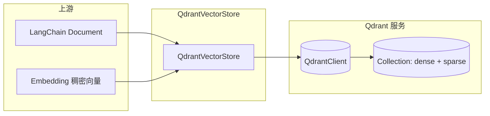
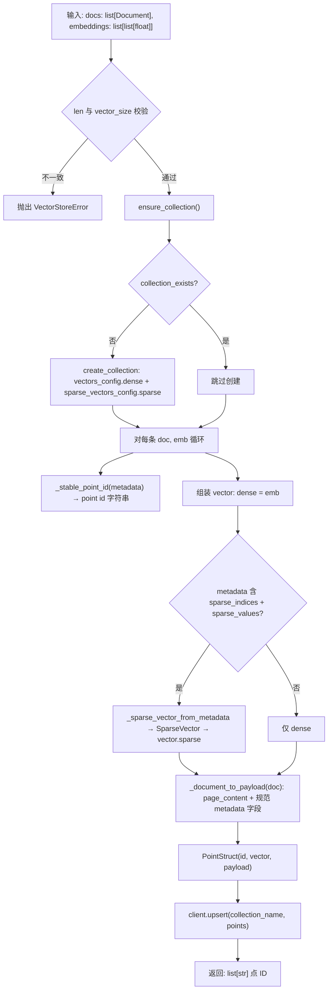
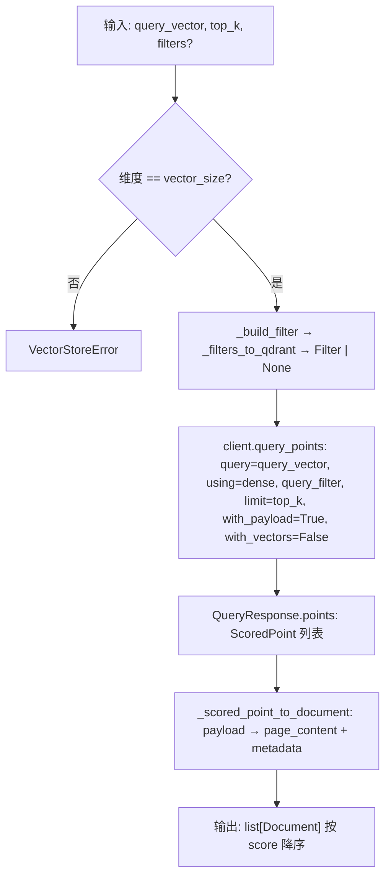
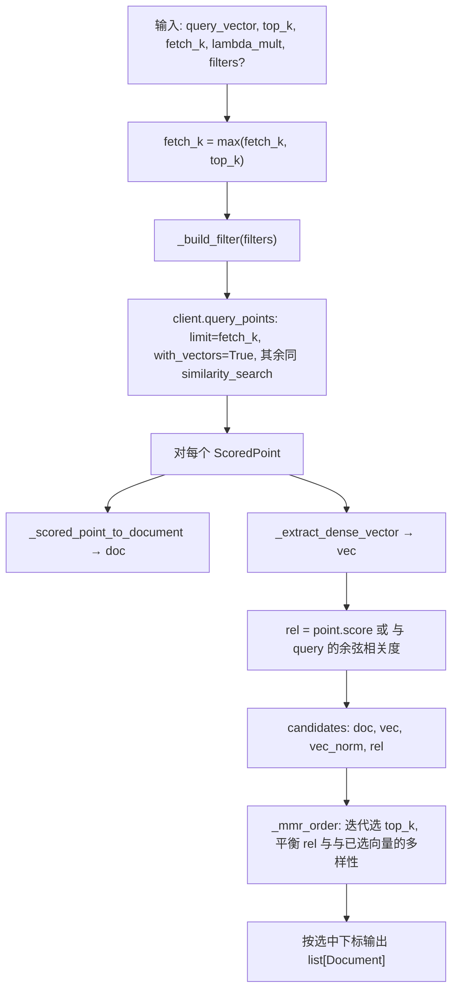
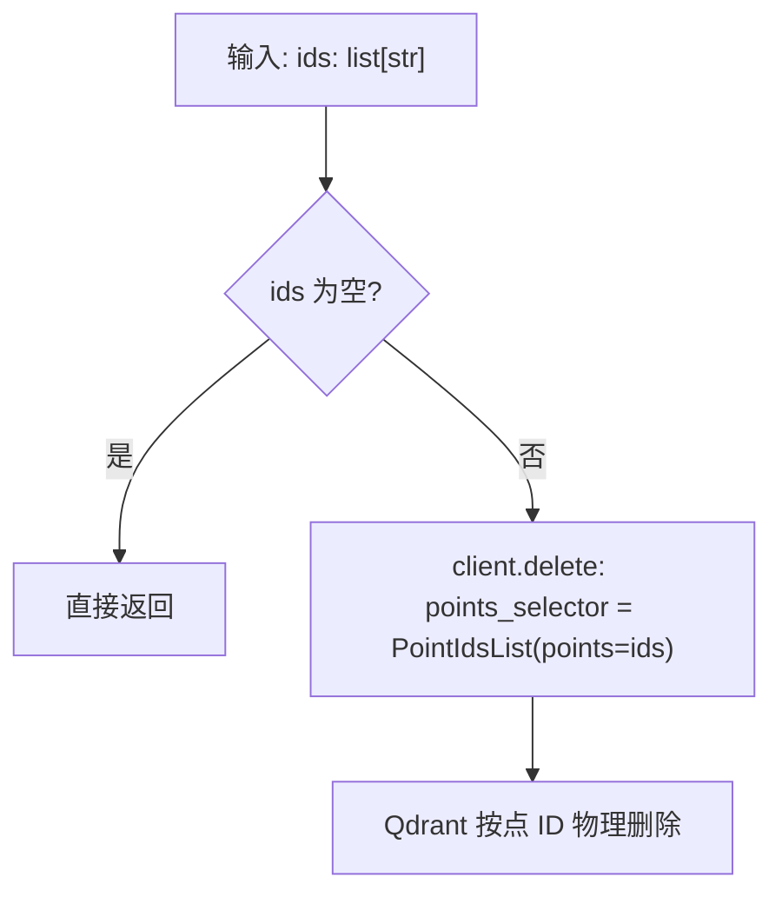

# Qdrant 层数据流转说明

本文描述 `python-backend/app/rag/vectorstore/qdrant_store.py` 中 **`QdrantVectorStore`** 封装下的向量写入、检索与删除的数据流转，便于与上游 Embedding、下游 Agent 编排对齐。

---

## 1. 总体结构

- **命名向量**：稠密 `dense`（必选写入）、稀疏 `sparse`（可选，由 metadata 约定字段驱动）。
- **Payload**：业务可过滤字段 + 正文 `page_content`，与向量一并落在同一 Point 上。

---

## 2. 写入数据流：`add_documents`

从「文档 + 已算好的稠密向量」到「Qdrant 中的 Point」的完整路径如下。

**数据形态变化摘要**

| 阶段 | 内容 |
|------|------|
| 输入 | `Document.page_content`、`Document.metadata`（含可选 `sparse_*`）、与之一一对应的 `embeddings` |
| 点 ID | 有 `chunk_id` / `point_id` 时 **UUID5** 稳定生成，否则 **UUID4** |
| 向量字段 | `{"dense": [...], "sparse": SparseVector(...)?}` |
| Payload | `page_content` + `knowledge_id`、`chunk_id`、`platform` 等规范键（不含 `sparse_indices` / `sparse_values`） |
| 输出 | 与 docs 等长的 **point id 字符串列表**（供删除或 MySQL 回写关联） |

---

## 3. 相似检索数据流：`similarity_search`

以「查询稠密向量 + 可选过滤」驱动 Qdrant，再还原为 LangChain `Document`。

**数据形态变化摘要**

| 阶段 | 内容 |
|------|------|
| 过滤侧 | 业务 `dict` → Qdrant `Filter`（`MatchValue` / `MatchAny` / `Range`） |
| 服务端 | 在命名向量 `dense` 上做近邻检索，返回 `score` + `payload` |
| 输出侧 | `payload.page_content` → `Document.page_content`，其余 payload 键 → `Document.metadata` |

---

## 4. MMR 检索数据流：`mmr_search`

**两段式**：先在 Qdrant 拉一批带向量的候选，再在应用进程内做 MMR 重排。

**数据形态变化摘要**

| 阶段 | 内容 |
|------|------|
| Qdrant | 返回 `fetch_k` 条候选，**携带 `dense` 向量**（MMR 需要算文档间相似度） |
| 本地 | 用 `lambda_mult * rel - (1 - lambda_mult) * max_cos_sim(候选, 已选)` 迭代选点 |
| 输出 | 长度最多为 `top_k` 的 `Document` 列表（顺序为 MMR 重排结果，不再等同纯向量分数排序） |

---

## 5. 删除数据流：`delete`

`ids` 通常为上文 **`add_documents` 返回值**，或与 `_stable_point_id` 规则一致的 id。

---

## 6. 与配置的关系

应用侧可将 `config.py` 中的 `qdrant_host`、`qdrant_port`、`qdrant_collection` 注入 `QdrantVectorStore` 构造函数；**集合 schema（维度、距离）** 由构造参数 `vector_size`、`distance` 与 `ensure_collection` 首次创建时确定，需与 **Embedding 输出维度** 一致。

---

## 7. 文件索引

| 符号 | 位置 |
|------|------|
| `QdrantVectorStore` | `app/rag/vectorstore/qdrant_store.py` |
| 协议契约 `BaseVectorStore` | `app/rag/base.py` |
| 异常 `VectorStoreError` | `app/rag/exceptions.py` |
