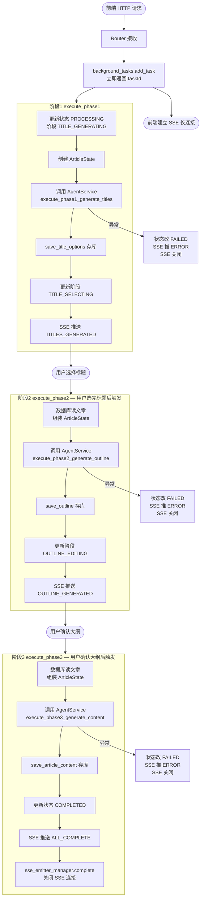
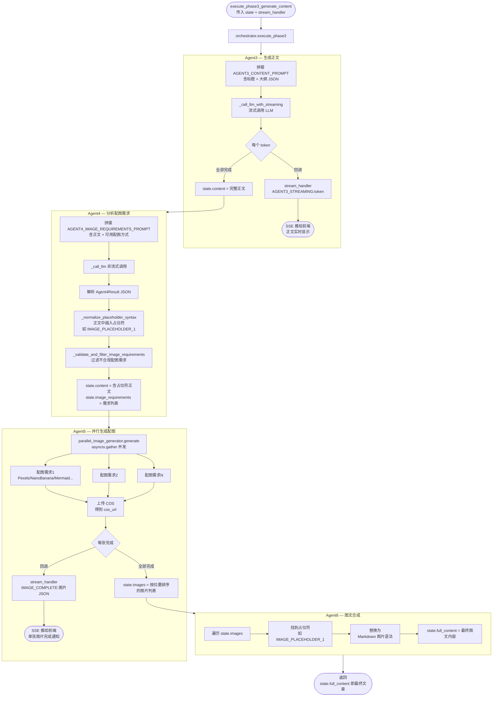
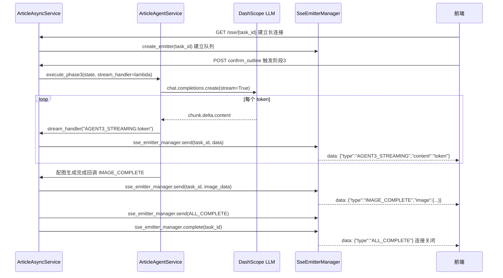

# `article_agent_service.py` & `article_async_service.py` 解析笔记

---

## 一、各自的主要功能

### `article_agent_service.py` — AI 执行层

**核心定位：** 直接和 LLM / 图片 API 打交道，负责"怎么生成内容"。

每个 `agentN_xxx` 方法对应一个独立的智能体步骤：

| 方法 | 智能体 | 功能 |
|---|---|---|
| `agent1_generate_title_options` | Agent1 | 调用 LLM 生成 3~5 个标题方案 |
| `agent2_generate_outline` | Agent2 | 调用 LLM **流式**生成文章大纲 |
| `agent3_generate_content` | Agent3 | 调用 LLM **流式**生成正文 |
| `agent4_analyze_image_requirements` | Agent4 | 调用 LLM 分析配图需求，在正文中插入占位符 |
| `agent5_generate_images` | Agent5 | **并行**调用多种图片服务生成配图 |
| `merge_images_into_content` | Agent6 | 将图片 URL 替换占位符，完成图文合成 |
| `ai_modify_outline` | 辅助 | 用户请求 AI 修改大纲时调用 |

**该层只关心：**
- 拼接 Prompt
- 调用 `_call_llm()` / `_call_llm_with_streaming()`
- 解析 LLM 返回的 JSON
- 把结果写入 `ArticleState`

**该层完全不关心：**
- 数据库怎么存
- 错误了给前端发什么消息
- 阶段状态怎么流转

---

### `article_async_service.py` — 异步编排层

**核心定位：** 管理"一个阶段从开始到结束"的完整流程，负责"流程怎么跑"。

三个核心方法对应文章生成的三个阶段：

| 方法 | 阶段 | 做了什么 |
|---|---|---|
| `execute_phase1` | 阶段1 | 更新状态 → 调 Agent1 → 存标题方案 → SSE 推送 |
| `execute_phase2` | 阶段2 | 读数据库 → 调 Agent2 → 存大纲 → SSE 推送 |
| `execute_phase3` | 阶段3 | 读数据库 → 调 Agent3~6 → 存内容 → SSE 推送 → 完成 |

**每个阶段方法都做这五件事：**
1. 从数据库读取文章上下文，组装 `ArticleState`
2. 更新数据库中的状态/阶段字段
3. 调用 `ArticleAgentService` 执行 AI 生成
4. 将 AI 生成结果存入数据库
5. 通过 `sse_emitter_manager` 把进度/结果推送给前端

**异常统一兜底：** 任何阶段抛出异常，该层负责将数据库状态改为 `FAILED`，并推送 `ERROR` 消息给前端，不会让错误静默丢失。

---

## 二、两者的关系

### 调用关系图

```
Router（HTTP 接口）
    │
    │  异步触发（background_tasks.add_task）
    ▼
ArticleAsyncService          ← 编排层（流程管家）
    │
    │  调用各 Agent 方法
    ▼
ArticleAgentService          ← 执行层（AI 工厂）
    │
    ├── _call_llm()           → DashScope / OpenAI API
    ├── _call_llm_with_streaming() → 流式 token
    └── parallel_image_generator  → 图片 API（Pexels / NanoBanana 等）
```

### 职责边界对比

| 对比维度 | `ArticleAgentService` | `ArticleAsyncService` |
|---|---|---|
| **定位** | AI 执行层 | 异步编排层 |
| **关心什么** | 如何调用 LLM / 图片 API | 整个阶段的流程编排 |
| **知道数据库吗** | 不知道 | 知道（读写数据库） |
| **知道 SSE 吗** | 不知道 | 知道（发消息给前端） |
| **知道 ArticleState 吗** | 知道（直接读写） | 知道（创建并传入） |
| **知道错误处理吗** | 只抛出异常 | 捕获异常、更新状态、推送错误 |
| **是否持有 LLM 客户端** | 是（`AsyncOpenAI`） | 否 |
| **是否持有 SSE Manager** | 否 | 是（`sse_emitter_manager`） |

### 数据流向

```
[阶段2 完整数据流示例]

execute_phase2(task_id)
    │
    ├─① 数据库读文章 → 组装 ArticleState（task_id / title / style）
    │
    ├─② update_phase(OUTLINE_GENERATING)  → 写数据库
    │
    ├─③ agent2_generate_outline(state, stream_handler)
    │       │
    │       ├─ 拼接 AGENT2_OUTLINE_PROMPT
    │       ├─ _call_llm_with_streaming()  → 每个 token 回调 stream_handler
    │       │       └─ stream_handler 调用 _handle_agent_message()
    │       │               └─ sse_emitter_manager.send()  → 推给前端
    │       └─ 解析 JSON → 写入 state.outline
    │
    ├─④ save_outline(state.outline)  → 写数据库
    │
    ├─⑤ update_phase(OUTLINE_EDITING)  → 写数据库
    │
    └─⑥ _send_sse_message(OUTLINE_GENERATED, outline_data)  → 通知前端大纲完成
```

---

## 三、关键设计解析

### 3.1 `stream_handler` 回调：解耦流式推送

`ArticleAgentService` 并不直接调用 `sse_emitter_manager`，而是接受一个回调函数 `stream_handler`：

```python
# article_async_service.py 中注册回调
await article_agent_service.execute_phase2_generate_outline(
    state,
    lambda message: self._handle_agent_message(task_id, message, state)
)

# article_agent_service.py 中触发回调（完全不知道 SSE 的存在）
stream_handler(message_type.get_streaming_prefix() + content)
```

**好处：** `ArticleAgentService` 与 SSE 完全解耦，可以在单元测试中传入任意 `stream_handler`（如打印到控制台），不需要真实的 SSE 连接。

---

### 3.2 `ArticleState` 作为数据总线

两个 Service 通过 `ArticleState` 传递数据，而非函数参数层层传递：

```python
# ArticleAsyncService 创建 State，注入初始数据
state = ArticleState()
state.task_id = task_id
state.title = TitleResult(mainTitle=..., subTitle=...)

# ArticleAgentService 读取 State，写入结果
async def agent2_generate_outline(self, state, stream_handler):
    prompt = prompt.replace("{mainTitle}", state.title.main_title)  # 读
    state.outline = OutlineResult(sections=sections)                # 写

# ArticleAsyncService 拿走结果存库
await article_service.save_outline(task_id, state.outline.sections)
```

---

### 3.3 阶段触发时机

三个阶段不是一次性连续执行的，而是**由用户交互分隔**：

```
阶段1 execute_phase1
    └─ AI 生成标题 → 推送给前端
         ↕ [用户选择标题，触发 confirm_title 接口]
阶段2 execute_phase2
    └─ AI 生成大纲 → 推送给前端
         ↕ [用户编辑/确认大纲，触发 confirm_outline 接口]
阶段3 execute_phase3
    └─ AI 生成正文 + 配图 → 推送给前端 → 流程结束
```

每个阶段的入口都是独立的 HTTP 请求，通过 `background_tasks.add_task` 在后台异步执行，HTTP 接口立刻返回，前端通过 SSE 长连接接收后续进度。

---

### 3.4 全局单例

```python
# article_async_service.py 末尾
article_async_service = ArticleAsyncService()
```

整个应用只有一个 `ArticleAsyncService` 实例，在 Router 中直接 import 使用，避免每次请求重复创建对象。`ArticleAgentService` 则在每个阶段方法内部 **局部实例化**（因为它持有 LLM 客户端，未来可能需要按请求隔离配置）。

---

## 四、面试常考问题

### Q1：为什么把 Agent 执行和流程编排拆成两个 Service？

**单一职责原则（SRP）。** 如果合并到一起：
- 测试时无法单独测 AI 调用逻辑（因为混入了数据库和 SSE 依赖）
- 未来想换 LLM 服务商，需要改动包含数据库逻辑的代码，风险更高
- 未来想给某个阶段加重试机制，只需改编排层，不影响 AI 层

---

### Q2：`stream_handler` 回调函数体现了什么设计原则？

**依赖倒置原则（DIP）。** 高层模块（AgentService）不依赖具体的 SSE 实现，而是依赖抽象（回调函数接口）。调用方（AsyncService）在注入回调时才绑定具体行为，AgentService 本身可以在任意环境下复用。

---

### Q3：`background_tasks.add_task` 和直接 `await` 的区别？

```python
# 直接 await：等 AI 跑完才返回 HTTP 响应（可能超时几十秒）
await article_async_service.execute_phase1(task_id, topic)

# background_tasks：立刻返回 HTTP 响应，AI 在后台异步跑
background_tasks.add_task(article_async_service.execute_phase1, task_id, topic)
```

AI 生成耗时长（10~60 秒），用 `background_tasks` 让接口立刻返回 `200`，前端通过 SSE 连接实时接收进度，是长耗时任务的标准做法。

---

### Q4：阶段3 中配图为什么要并行执行？

```python
# parallel_image_generator 内部用 asyncio.gather 并发执行
generated_pairs = await self.parallel_image_generator.generate(state.image_requirements)
```

一篇文章可能有 5~8 张配图，每张需要调用外部 API（Pexels / NanoBanana），串行执行需要 N × 单张耗时。并行后总耗时约等于最慢的那张，可将配图阶段从数十秒压缩到几秒。

---

### Q5：两个 Service 中的异常处理策略有何不同？

| | AgentService | AsyncService |
|---|---|---|
| 遇到异常 | 直接 `raise RuntimeError(...)` 上抛 | `try/except` 统一捕获 |
| 处理方式 | 不处理，交给上层 | 写库状态为 `FAILED`，推 `ERROR` 消息 |
| 原因 | 专注执行，不负责善后 | 流程兜底，确保前端能感知到错误 |

---

## 五、执行流程图（Mermaid）

### 5.1 `ArticleAsyncService` 三阶段总流程



---

### 5.2 `ArticleAgentService` 阶段3 内部执行流程（Agent3~6）



---

### 5.3 `stream_handler` 回调链路细节


