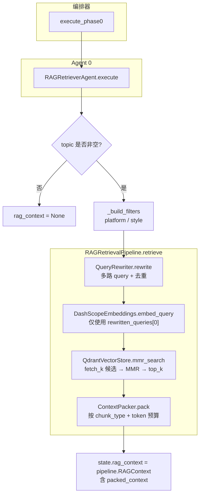
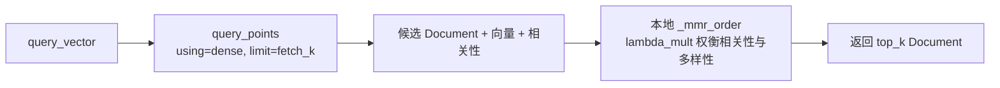
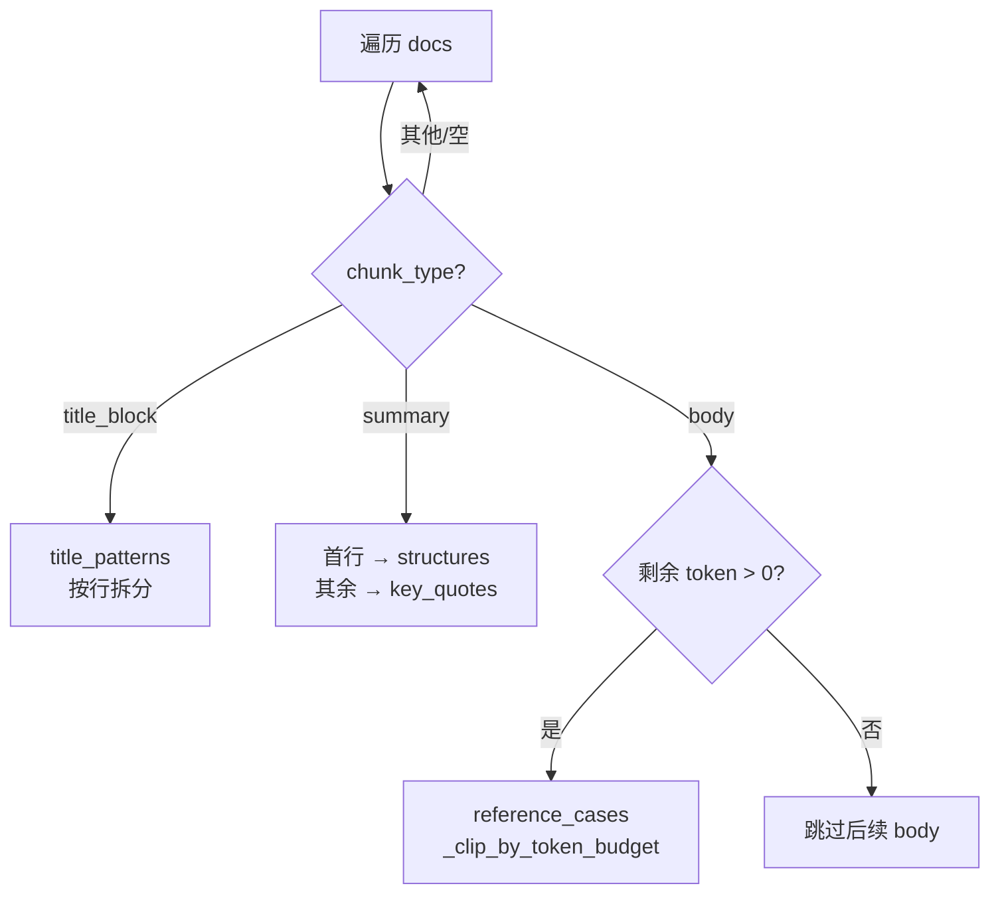

# 检索层说明（`app/rag/retrieval` + `RAGRetrievalPipeline`）

本文描述当前代码中与「知识库向量检索 → 上下文打包 → 注入创作状态」相关的流程，对应目录主要为：

- `python-backend/app/rag/retrieval/`：`QueryRewriter`、`ContextPacker`、`reranker`（接口与占位实现）
- `python-backend/app/rag/pipeline.py`：`RAGRetrievalPipeline.retrieve`
- `python-backend/app/rag/vectorstore/qdrant_store.py`：`mmr_search`（候选召回 + 本地 MMR）
- 编排入口：`python-backend/app/agent/agents/rag_retriever.py`、`python-backend/app/agent/orchestrator.py`

---

## 1. 检索层在系统中的位置

检索发生在文章创作的 **阶段 0**：在阶段 1（标题生成）之前，`ArticleAgentOrchestrator.execute_phase0` 调用 `RAGRetrieverAgent`，将结果写入 `ArticleState.rag_context`。检索失败仅记录告警，**不阻断**后续标题 / 大纲 / 正文链路。

知识库 HTTP 接口（`KnowledgeService`）当前主要负责 **入库与文档管理**，不负责对外检索编排；创作链路上的检索由编排器内建的 `RAGRetrievalPipeline` 完成。

---

## 2. 模块职责一览

| 组件 | 文件 | 职责 |
|------|------|------|
| `RAGRetrieverAgent` | `agent/agents/rag_retriever.py` | 从 `ArticleState` 读取选题与可选过滤条件，调用 `retrieve`，写回 `rag_context` |
| `RAGRetrievalPipeline` | `rag/pipeline.py` | 串联：改写 → 向量化 → MMR 检索 → 上下文打包 |
| `QueryRewriter` | `rag/retrieval/query_rewriter.py` | 生成多路检索用语（原始 query + 标题模板扩展 + 关键词串），去重 |
| `DashScopeEmbeddings` | `rag/embedding/dashscope_embeddings.py` | 将用于检索的文本编码为稠密向量 |
| `QdrantVectorStore.mmr_search` | `rag/vectorstore/qdrant_store.py` | 稠密向量检索 `fetch_k` 条候选，按 MMR 选出 `top_k` 条，支持 Payload 过滤 |
| `ContextPacker` | `rag/retrieval/context_packer.py` | 按 `chunk_type` 归类片段，控制正文 token 预算，产出结构化素材 |
| `BaseReranker` / `PassthroughReranker` | `rag/retrieval/reranker.py` | **一期占位**：定义重排序接口；当前流水线 **未接入**，检索后直接进入打包 |

---

## 3. 端到端数据流

1. **输入**：`state.topic`（选题）；可选 `state.platform`、`state.style` 转为 Qdrant **Payload 过滤**。
2. **Query 改写**：`QueryRewriter.rewrite` 返回列表，首元素为规范化后的原始 query，其后为模板句与关键词拼接结果（已去重）。
3. **向量化**：流水线仅对 **`rewritten_queries[0]`**（即原始选题）调用 `embed_query`。其余改写结果当前用于拼接日志字段 `rewritten_query`，**未**各自发起多次向量检索。
4. **向量检索**：`mmr_search` 使用命名向量 `dense`，默认先取 `fetch_k=20` 条候选，再在本地做 MMR（默认 `lambda_mult=0.5`），返回 `top_k`（Agent 侧传入为 `5`）。
5. **打包**：`ContextPacker.pack` 依据 `metadata.chunk_type` 分流；`body` 类型按 `max_tokens`（默认 3000，粗估 `len//2`）做预算裁剪。
6. **输出**：`ArticleState.rag_context` 类型为 **`app.rag.pipeline.RAGContext`**（与 `app.rag.retrieval.context_packer.RAGContext` **同名不同类**，见下文）。

---

## 4. 两种 `RAGContext` 的含义（避免混淆）

| 类型 | 定义位置 | 用途 |
|------|-----------|------|
| `app.rag.pipeline.RAGContext` | `pipeline.py` | 流水线对外返回值：`query`、`rewritten_query`、`documents`、`packed_context`；`ArticleState.rag_context` 使用此类 |
| `app.rag.retrieval.context_packer.RAGContext` | `context_packer.py` | **打包后的结构化素材**：`title_patterns`、`structures`、`key_quotes`、`reference_cases`、`raw_chunks`、`source_doc_ids`；挂在 `pipeline.RAGContext.packed_context` 上 |

下游 Agent 若要用「分类后的素材」，应读取 `state.rag_context.packed_context`（类型为打包器的 `RAGContext`）。

---

## 5. `ContextPacker` 分类规则（简要）

- **`title_block`**：按行拆分，归入 `title_patterns`。
- **`summary`**：第一行归入 `structures`，其余行归入 `key_quotes`。
- **`body`**：在剩余 token 预算内截取片段，依次追加到 `reference_cases`；预算用尽则停止处理后续 `body`。
- 所有列表经过去重且保持顺序；`source_doc_ids` 从 metadata 的 `doc_id` / `source_doc_id` / `knowledge_doc_id` 收集。

各步骤继承 `RAGLoggerMixin` 时可写入追踪日志（若已初始化日志服务）。

---

## 6. 流程图

### 6.1 创作链路中的检索总览

### 6.2 `mmr_search` 内部逻辑（向量库侧）

### 6.3 `ContextPacker.pack` 分流

---

## 7. 与规划文档的差异（演进方向）

对照 `AGENTS.md` / `RAG_TECH_DESIN.md` 中的完整检索设计，当前实现侧重「可跑通的一条链路」，尚未落地的典型项包括：

- **多 query 各自检索或融合**：改写结果仅首条用于 embedding。
- **Hybrid（Dense + Sparse）**：`QdrantVectorStore` 虽支持稀疏向量写入，`mmr_search` 当前仅以稠密 `dense` 检索。
- **Rerank**：`PassthroughReranker` 未编入 `RAGRetrievalPipeline`。
- **Query Rewrite 的 LLM 增强**：当前 `QueryRewriter` 为规则模板 + 停用词过滤，无额外模型调用。

后续若在流水线中插入 `rerank` 或多次检索，建议在 `RAGRetrievalPipeline.retrieve` 内扩展，并保持 `retrieval/` 下单模块职责单一、可替换。

---

## 8. 关键默认参数（便于联调）

| 参数 | 位置 | 默认值 / 调用值 |
|------|------|------------------|
| `top_k` | `RAGRetrieverAgent` → `retrieve` | `5` |
| `fetch_k` | `mmr_search` | `20` |
| `lambda_mult` | `mmr_search` | `0.5` |
| `ContextPacker.max_tokens` | `ContextPacker()` | `3000` |
| 向量维度 | 编排器内 `QdrantVectorStore` / `DashScopeEmbeddings` | `1024`（须与集合配置一致） |

---

*文档与仓库代码路径：`python-backend/app/rag/retrieval/`、`python-backend/app/rag/pipeline.py`（`RAGRetrievalPipeline`）。*
