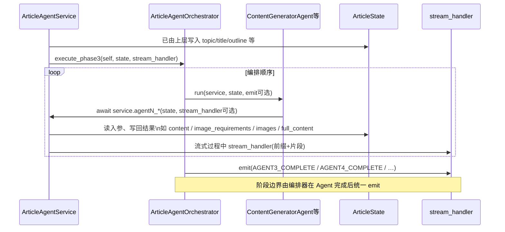
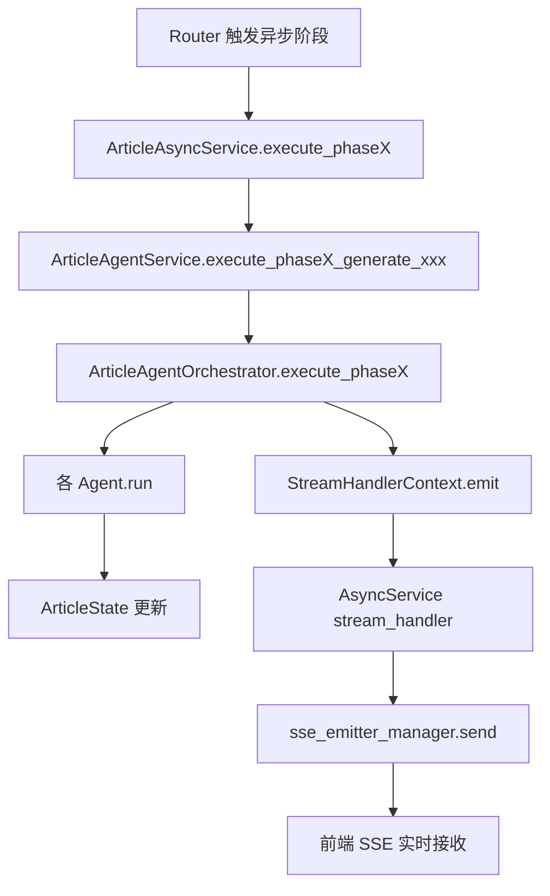
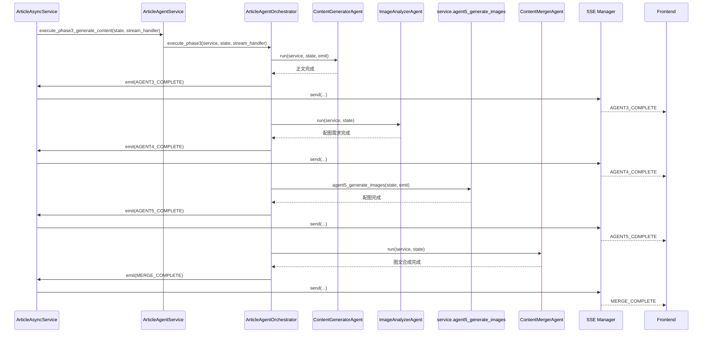

# `agent/orchestrator.py` 编排层说明 

## 这个编排器的核心作用

`python-backend/app/agent/orchestrator.py` 中的 `ArticleAgentOrchestrator` 是多 Agent 工作流的**流程编排器**。  
它不直接做 LLM 调用、图片上传、数据库写入，而是负责：

- **定义执行顺序**：哪个 Agent 先跑、哪个后跑
- **串联阶段边界**：Phase1 / Phase2 / Phase3 的分段流程
- **统一消息发射**：在关键节点发出 `SseMessageTypeEnum` 事件
- **承接共享状态**：所有 Agent 基于同一个 `ArticleState` 读写

一句话：**它是“流程导演”，各 Agent 是“演员”。**

---

## 结构总览

在 `__init__` 中初始化了 5 个 Agent：

- `TitleGeneratorAgent`：标题生成
- `OutlineGeneratorAgent`：大纲生成
- `ContentGeneratorAgent`：正文生成
- `ImageAnalyzerAgent`：配图需求分析
- `ContentMergerAgent`：图文合成

并在每个阶段执行方法里通过 `StreamHandlerContext` 统一输出事件：

- `execute_phase1(...)`
- `execute_phase2(...)`
- `execute_phase3(...)`

---

## 编排层与 Agent 服务层的数据流转

`ArticleAgentService`（Agent 服务层）在初始化时持有 `self.orchestrator = ArticleAgentOrchestrator()`。  
异步任务调用 `execute_phaseX_generate_xxx(self, state, stream_handler)` 时，**由服务层把自身引用 `self`、共享状态 `state`、以及上游注入的 `stream_handler` 一并交给编排器**；编排器按阶段调用各 `*Agent.run(...)`，Agent 再**回调**服务层上的 `agent1_`* / `agent2_*` 等方法完成真正的 LLM 与业务逻辑。

**数据与职责分工：**


| 对象                            | 谁持有                                         | 流转内容                                            |
| ----------------------------- | ------------------------------------------- | ----------------------------------------------- |
| `ArticleState`                | 由 AsyncService 创建，经 Service 传入 Orchestrator | 各步骤读写同一状态（黑板）                                   |
| `stream_handler`              | 来自 AsyncService 的 lambda                    | 经 `StreamHandlerContext.emit` 透传，流式 token 与完成事件 |
| `ArticleAgentService`（`self`） | 服务单例/实例                                     | 编排器与各 Agent 通过 `service` 调用具体 `agentN_`* 实现     |


---

### 关系总览图（编排 ↔ 服务 ↔ 状态）

```mermaid
flowchart LR
    subgraph AgentServiceLayer [ArticleAgentService 服务层]
        SVC[ArticleAgentService]
        LLM[AsyncOpenAI / 图片策略等]
        SVC --> LLM
    end

    subgraph OrchestrationLayer [ArticleAgentOrchestrator 编排层]
        ORC[Orchestrator]
        A1[TitleGeneratorAgent]
        A2[OutlineGeneratorAgent]
        A3[ContentGeneratorAgent]
        A4[ImageAnalyzerAgent]
        A6[ContentMergerAgent]
        ORC --> A1
        ORC --> A2
        ORC --> A3
        ORC --> A4
        ORC --> A6
    end

    STATE[(ArticleState\n共享黑板)]
    EMIT[[stream_handler / emit]]

    SVC -->|execute_phaseX_generate_xxx\n传入 self, state, stream_handler| ORC
    ORC -->|run(service, state, …)| A1
    ORC -->|run(service, state, …)| A2
    ORC -->|run(service, state, …)| A3
    ORC -->|run(service, state)| A4
    ORC -->|agent5_generate_images| SVC

    A1 -->|await service.agent1_*| SVC
    A2 -->|await service.agent2_*| SVC
    A3 -->|await service.agent3_*| SVC
    A4 -->|await service.agent4_*| SVC
    A6 -->|service.merge_images_into_content| SVC

    SVC <-->|读/写字段| STATE
    ORC -->|各阶段完成信号| EMIT
    SVC -.->|流式片段\nagent2/3/5 内部| EMIT
```


说明：配图阶段（Agent5）由编排器**直接调** `service.agent5_generate_images`，不经过单独的 `Agent` 包装类，但数据仍走同一 `state` 与同一 `emit` 通道。

---

### 调用与数据时序图（以 Phase3 为例）




---

## 分阶段逻辑讲解

## `execute_phase1`

逻辑：

1. 创建 `StreamHandlerContext`
2. 调 `title_agent.run(service, state)`
3. 发事件 `AGENT1_COMPLETE`

作用：完成标题候选生成，并通知上层“Agent1 完成”。

---

## `execute_phase2`

逻辑：

1. 创建 `StreamHandlerContext`
2. 调 `outline_agent.run(service, state, stream_context.emit)`
  - 大纲过程可流式输出（逐段消息）
3. 发事件 `AGENT2_COMPLETE`

作用：生成大纲并对外实时推送过程，结束后发完成事件。

---

## `execute_phase3`

这是主干阶段，串行编排 4 个子步骤：

1. `content_agent.run(service, state, stream_context.emit)`
  - 生成正文（流式）
  - 发 `AGENT3_COMPLETE`
2. `image_analyzer_agent.run(service, state)`
  - 分析配图需求与占位符
  - 发 `AGENT4_COMPLETE`
3. `service.agent5_generate_images(state, stream_context.emit)`
  - 执行配图生成（内部可并行）
  - 发 `AGENT5_COMPLETE`
4. `content_merger_agent.run(service, state)`
  - 图文合并
  - 发 `MERGE_COMPLETE`

作用：把“正文 -> 配图需求 -> 配图结果 -> 最终图文”完整串起来。

---

## 调用链路图（Mermaid）

### 1) 编排器在系统中的位置




---

### 2) 编排器内部流程图（按三个阶段）

```mermaid
flowchart TD
    START([Orchestrator 接收 service/state/stream_handler])

    START --> P1
    START --> P2
    START --> P3

    subgraph Phase1 [execute_phase1]
        P1A[创建 StreamHandlerContext] --> P1B[title_agent.run]
        P1B --> P1C[emit AGENT1_COMPLETE]
    end

    subgraph Phase2 [execute_phase2]
        P2A[创建 StreamHandlerContext] --> P2B[outline_agent.run with emit]
        P2B --> P2C[emit AGENT2_COMPLETE]
    end

    subgraph Phase3 [execute_phase3]
        P3A[创建 StreamHandlerContext] --> P3B[content_agent.run with emit]
        P3B --> P3C[emit AGENT3_COMPLETE]
        P3C --> P3D[image_analyzer_agent.run]
        P3D --> P3E[emit AGENT4_COMPLETE]
        P3E --> P3F[service.agent5_generate_images with emit]
        P3F --> P3G[emit AGENT5_COMPLETE]
        P3G --> P3H[content_merger_agent.run]
        P3H --> P3I[emit MERGE_COMPLETE]
    end
```




---

### 3) Phase3 详细时序图（最核心）




---

## 设计亮点（面试可用）

- **编排与执行分离**：Orchestrator 只管顺序，具体能力由 Agent / Service 实现
- **状态集中共享**：通过 `ArticleState` 避免参数爆炸，形成统一数据总线
- **事件驱动可观测**：每一步都有 `SseMessageTypeEnum` 完成事件，前端进度可视化
- **低耦合输出**：`StreamHandlerContext` 让编排层不直接依赖 SSE 实现

---

## 一句话总结

`ArticleAgentOrchestrator` 是多 Agent 流程的“中控层”：按既定顺序驱动各 Agent 执行、更新共享状态、发射阶段事件，从而把复杂生成链路组织成稳定可追踪的流水线。