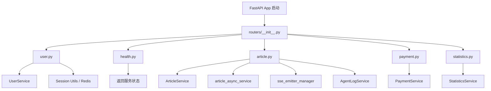
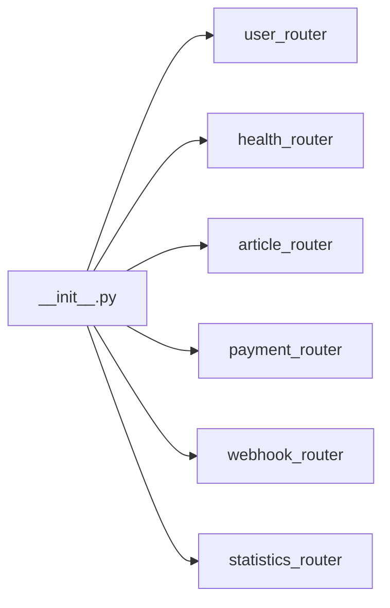
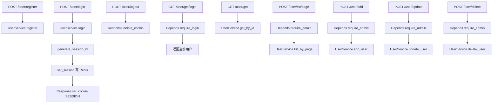
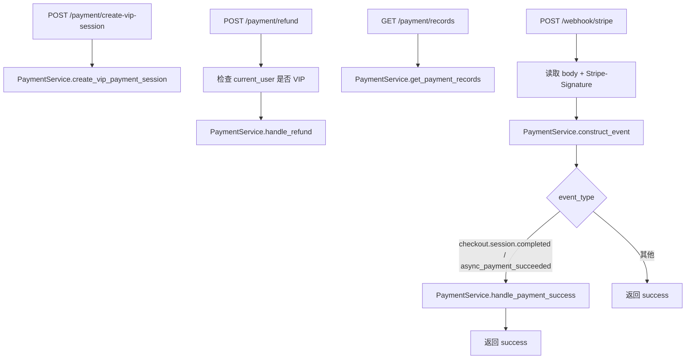

# `app/routers` 路由层说明

## 路由层的作用是什么？

`python-backend/app/routers` 是 FastAPI 的**接口入口层（Controller 层）**，核心职责是把 HTTP 请求转换为业务调用。

它主要做 5 件事：

- **定义 API 协议**：路径、HTTP 方法、入参/出参模型
- **接入依赖注入**：`Depends(get_db)`、`Depends(require_login)`、`Depends(require_admin)`
- **基础参数校验与权限门禁**：比如空值校验、登录校验、管理员校验
- **调用 Service 完成业务**：路由不写复杂业务逻辑，只做转发和组装响应
- **返回统一响应结构**：统一使用 `BaseResponse`

一句话：**路由层负责“接请求、做门禁、调服务、回响应”，不负责核心业务实现。**

---

## 文件结构与角色分工

- `__init__.py`：路由聚合导出层
- `health.py`：健康检查路由
- `user.py`：用户与会话相关路由
- `article.py`：文章生成主流程路由（含异步阶段推进与 SSE 入口）
- `payment.py`：支付会话、退款、支付回调路由
- `statistics.py`：管理员统计看板路由

---

## 总调用关系图（文件级）



---

## 各文件调用链路图

### 1) `routers/__init__.py`（路由注册聚合）

作用：统一导入并导出各子路由，供应用入口集中 `include_router`。



---

### 2) `routers/health.py`（健康检查）

```mermaid
flowchart LR
    A[GET /health] --> B[health_check()]
    B --> C[BaseResponse.success data='ok']
```

---

### 3) `routers/user.py`（用户与会话）



---

### 4) `routers/article.py`（文章主流程 + SSE）

```mermaid
flowchart TD
    C1[POST /article/create] --> S1[ArticleService.create_article_task_with_quota_check]
    S1 --> T1[asyncio.create_task execute_phase1]
    T1 --> AASYNC1[article_async_service.execute_phase1]

    P1[GET /article/progress/{task_id}] --> S2[ArticleService.get_article_detail 权限校验]
    S2 --> SSE1[sse_emitter_manager.create_emitter]
    SSE1 --> FE[前端长连接收进度]

    G1[GET /article/{task_id}] --> S3[ArticleService.get_article_detail]
    L1[POST /article/list] --> S4[ArticleService.list_article_by_page]
    D1[POST /article/delete] --> S5[ArticleService.delete_article]

    T2[POST /article/confirm-title] --> S6[ArticleService.confirm_title]
    S6 --> T3[asyncio.create_task execute_phase2]
    T3 --> AASYNC2[article_async_service.execute_phase2]

    O1[POST /article/confirm-outline] --> S7[ArticleService.confirm_outline]
    S7 --> T4[asyncio.create_task execute_phase3]
    T4 --> AASYNC3[article_async_service.execute_phase3]

    M1[POST /article/ai-modify-outline] --> S8[ArticleService.ai_modify_outline]

    E1[GET /article/execution-logs/{task_id}] --> LOG1[AgentLogService.get_execution_stats]
```

---

### 5) `routers/payment.py`（支付与回调）



---

### 6) `routers/statistics.py`（管理员统计）


---

## 路由层设计特点（结合本项目）

- **薄路由、厚服务**：路由只做协议与编排，业务规则沉到 `services/`
- **统一响应模型**：降低前端适配复杂度
- **依赖注入清晰**：DB、登录态、权限都在函数签名可见
- **异步任务友好**：文章生成使用 `asyncio.create_task`，避免接口长时间阻塞
- **实时推送入口明确**：`/article/progress/{task_id}` 专门负责 SSE 长连接

---

## 一句话总结

`app/routers` 是系统的 HTTP 网关层：把外部请求安全、规范地路由到内部服务，并在文章场景里承接了“异步阶段推进 + SSE 实时进度”这条核心链路。
